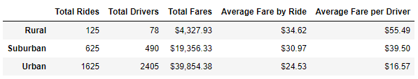
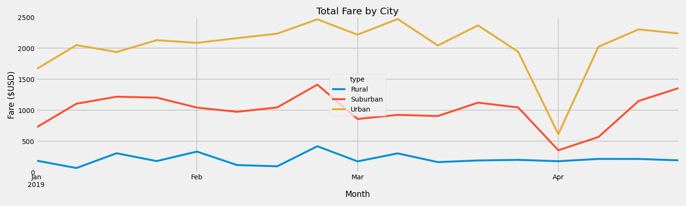

# PyBer_Analysis

V. Isualize has requested a brand-new analysis. Create a summary DataFrame of the ride-sharing data by city type. Then, create a multiple-line graph that shows the total weekly fares for each city type. Finally, submit a written report that summarizes how the data differs by city type and how those differences can be used by decision-makers at PyBer.

## Results:

As shown in the figure above the ride-sharing data includes: total rides, total drivers, total fares, average fare by ride and average fare per driver by city type.  While Urban types generate more rides and fares the data shows that the cost is higher as we move away from urban areas.  This is attributed to the the decrease in population and the distance one has to travel out in addition to the demand appears to be lower in suburban and rural areas.

## Summary:

In the first four-months of 2019, the graph above shows that the urban areas had the highest fares followed by suburban and rural areas.  This could signify a couple of things: 

  o Urbanites travel more, generating decreased ride fares
  o Distance traveled could contribut to the Driver Fare being higher for suburban and rural areas
  o Population density of the areas are a significant factor

